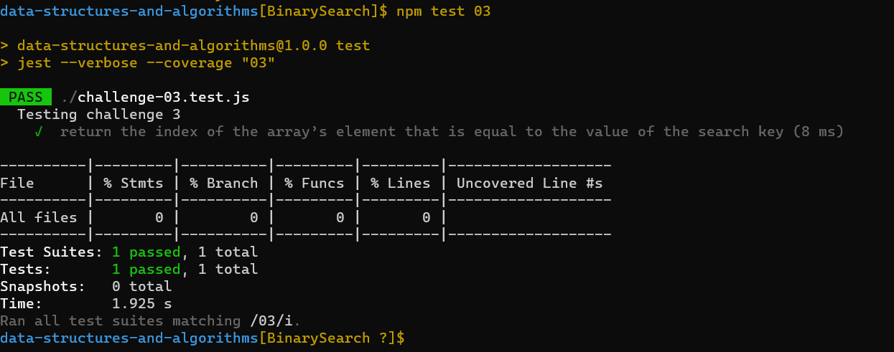

# BinarySearch

it's a new way to make our challenge and i like it because we know how the test work now and we do the test part 

## Whiteboard Process
<!-- Embedded whiteboard image -->

# proplem domain:

Write a function called BinarySearch which takes in 2 parameters: a sorted array and the search key. Without utilizing any of the built-in methods available to your language, return the index of the array’s element that is equal to the value of the search key, or -1 if the element is not in the array.

## algorthim
- I use while loop to iterative the array
- if statment to check the possibility 

### visual 
input:([2, 4, 6, -8], 5) output:([2, 4, 5, 6, -8])

## Approach & Efficiency
<!-- What approach did you take? Discuss Why. What is the Big O space/time for this approach? -->
I used while loop & if statment and quality test to make sure every things goes well.
