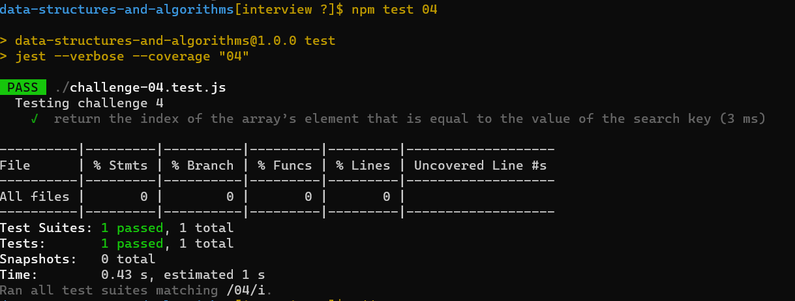

# Given a matrix, find the sum of each row.

it's a new way to make our challenge and i like it because we know how the test work now and we do the test part 

## Whiteboard Process
<!-- Embedded whiteboard image -->

# proplem domain:

write a function to add up the sum of each row in a matrix of arbitrary size, and return an array with the appropriate values.

## algorthim
- I use for loop to iterative the array and get the summation
- map for return 

### visual 
input:([[1, 2, 3], [3, 5, 7], [1, 7, 10]]) output:([6, 15, 18])

## Approach & Efficiency
<!-- What approach did you take? Discuss Why. What is the Big O space/time for this approach? -->
I used map & for loop and quality test to make sure every things goes well.