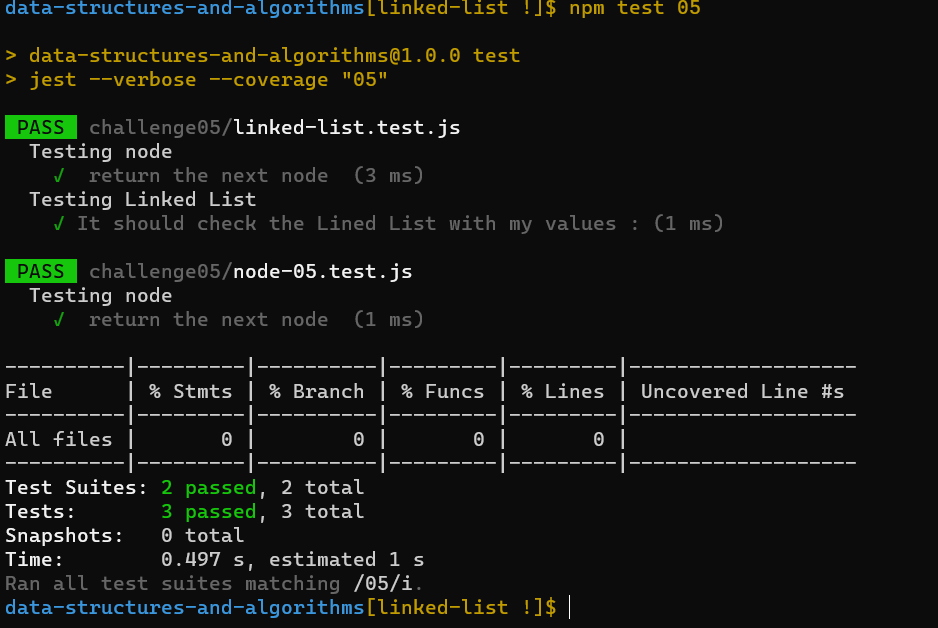

# Implementation: Singly Linked Lists

it's a new way to make our challenge and i like it because we know how the test work now and we do the test part 

## Whiteboard Process
<!-- Embedded whiteboard image -->

# proplem domain:

- Create a Node class that has properties for the value stored in the Node, and a pointer to the next Node.
- Create a Linked List class Within your Linked List class, include a head property.
Upon instantiation, an empty Linked List should be created The class should contain the following methods:

1. insert
2. includes
3. to string

## algorthim
- I use while loop to iterative the node 
- if statment to check the possibility  

#### Big O notation:

1. addMethod: o(n).
2. includesMethod: o(n).
3. toStringMethod:o(n).

## Approach & Efficiency
<!-- What approach did you take? Discuss Why. What is the Big O space/time for this approach? -->
I used while loop & if statment and quality test to make sure every things goes well.