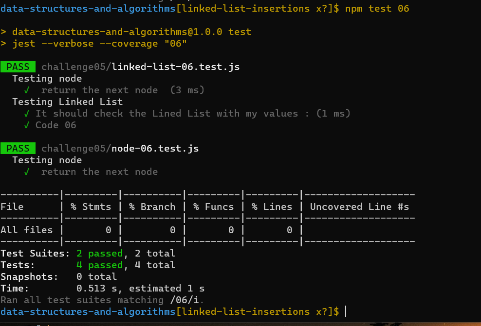

# linked-list-insertions:

Linked List is a linear data structure, linked list elements are not stored at a contiguous location; the elements are linked using pointers.

## Challenge:

- Create a Node class that has properties for the value stored in the Node, and a pointer to the next Node. -Create a Linked List class include a head property.
- The class should contain the following methods append,insert before,insert after

### Whiteboard Process:

## Approach & Efficiency
<!-- What approach did you take? Discuss Why. What is the Big O space/time for this approach? -->
- Creating the linkedlist and node class including the methods then testing the result

- Big O
  - Time <--- O(2)
  - Space <----- O(1)