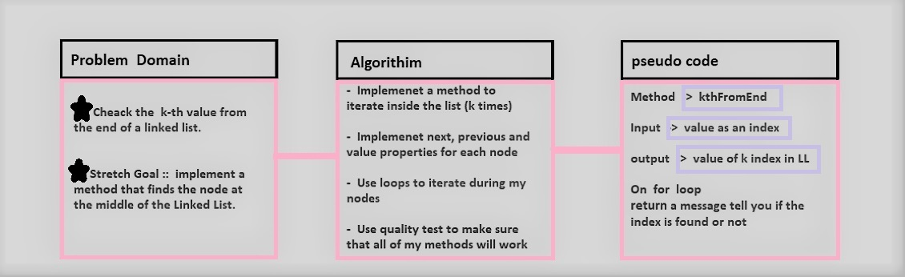
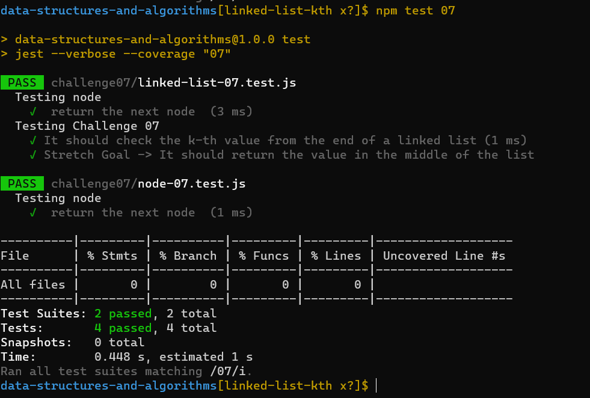

# linked-list-kth

## Challenge:

**Write the following method for the Linked List class:**

- kth from end
- argument: a number, k, as a parameter.
- Return the node’s value that is k places from the tail of the linked list.
- You have access to the Node class and all the properties on the Linked List class as well as the methods created in previous challenges.

### Whiteboard Process:

## Approach & Efficiency
<!-- What approach did you take? Discuss Why. What is the Big O space/time for this approach? -->
- I used class and quality test to make sure that all of my methods will work

- Big O
  - Time <--- O(n)
  - Space <----- O(n)