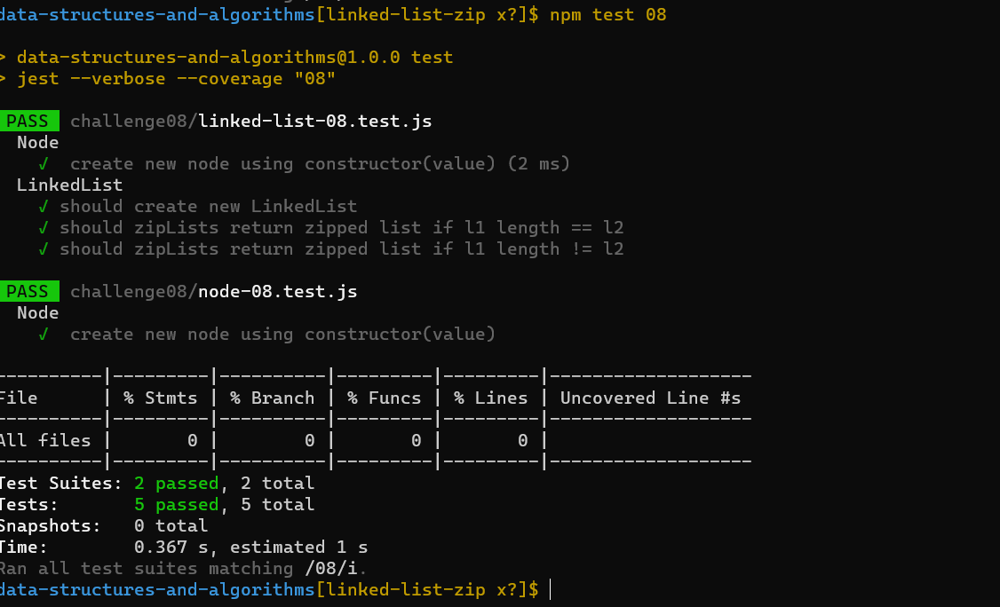

# linked-list-zip

Linked List is a linear data structure, linked list elements are not stored at a contiguous location; the elements are linked using pointers.

## Whiteboard Process
<!-- Embedded whiteboard image -->

# proplem domain:

- Write a function called zip lists
- Arguments: 2 linked lists
- Return: Linked List, zipped as noted below
- Zip the two linked lists together into one so that the nodes alternate between the two lists and return a reference to the head of the zipped list.
- Try and keep additional space down to O(1)
- You have access to the Node class and all the properties on the Linked List class as well as the methods created in previous challenges.

## Approach & Efficiency
<!-- What approach did you take? Discuss Why. What is the Big O space/time for this approach? -->
Creating the linkedlist and node class including the methods then testing the result

Big O
Time <--- O(n)
Space <----- O(1)