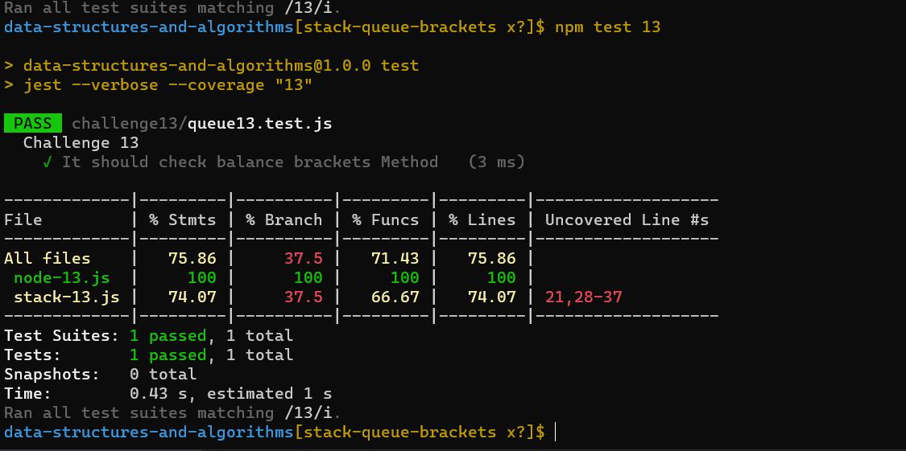

# data-structures-and-algorithms-401
# Code Challenge 13

## Whiteboard Process
<!-- Embedded whiteboard image -->

## Approach & Efficiency
<!-- What approach did you take? Why? What is the Big O space/time for this approach? -->
I used class and quality test to make sure that all of my methods will work
