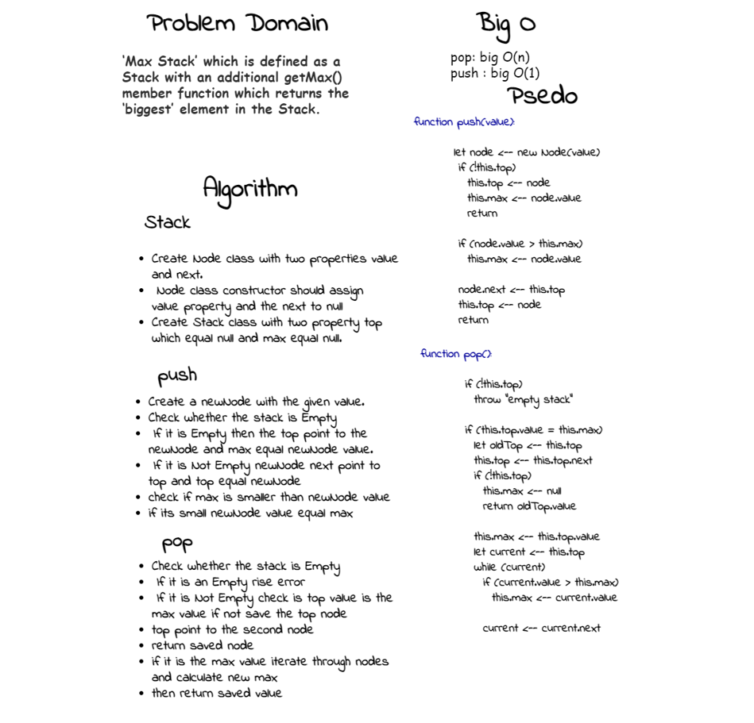
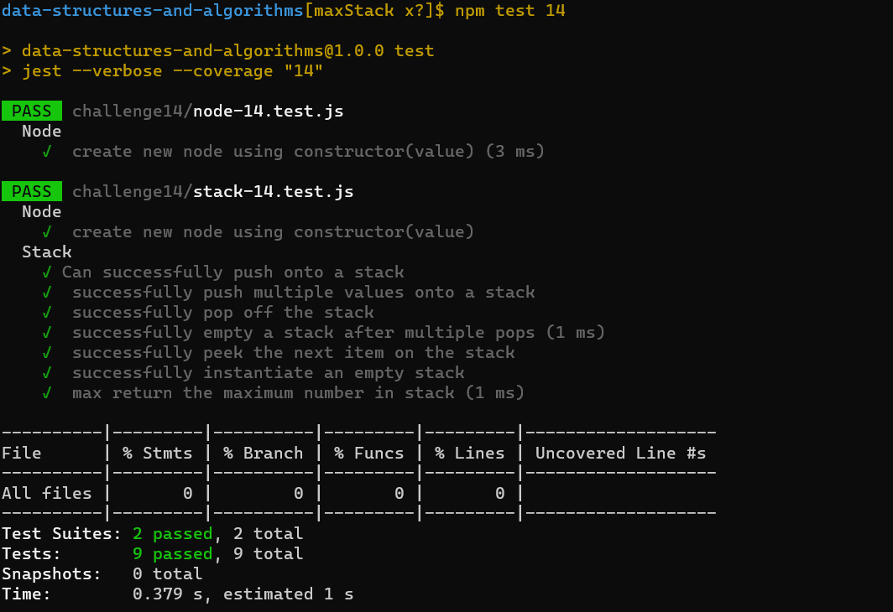

# data-structures-and-algorithms-401

## Code Challenge 14

**Max Stack**

- a Stack with an additional getMax() member function which returns the ‘biggest’ element in the Stack.

- write a ‘Max Stack’ which is defined as a Stack with an additional getMax() member function which returns the ‘biggest’ element in the Stack.

## Whiteboard Process
<!-- Embedded whiteboard image -->

## Approach & Efficiency
<!-- What approach did you take? Why? What is the Big O space/time for this approach? -->
In short, O(1) means that it takes a constant time, like 14 nanoseconds, or three minutes no matter the amount of data in the set, push with check if pushed element is grater than the max and change the max if it is the function pop time complexity O(n) increase linearly and in direct proportion to the number of inputs, becuse each time we pop element we calculate the max element in the stack again by iterating throgh all elements.

- pop: big O(n)
- push : big O(1)
- isEmpty: big O(1)
- peek: big O(1)