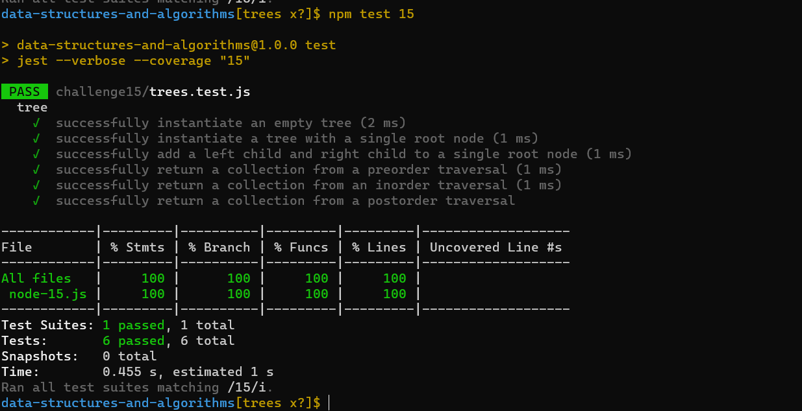

# data-structures-and-algorithms-401

## Code Challenge 15

- Create a Binary Tree class
- Create a Binary Search Tree class

### Tree

a hierarchical structure as elements in a Tree are arranged in multiple levels.

## Whiteboard Process
<!-- Embedded whiteboard image -->

## Approach & Efficiency
<!-- What approach did you take? Why? What is the Big O space/time for this approach? -->
The time complexity for Search for element or inserting an element to the list is O(log n) that because it halves the input set in each iteration, we ignore half of nodes each iteration

#### API

- preOrder root -> left -> right
- inOrder left -> root -> right
- postOrder left -> right -> root
- add node to tree
- check if tree contains a value