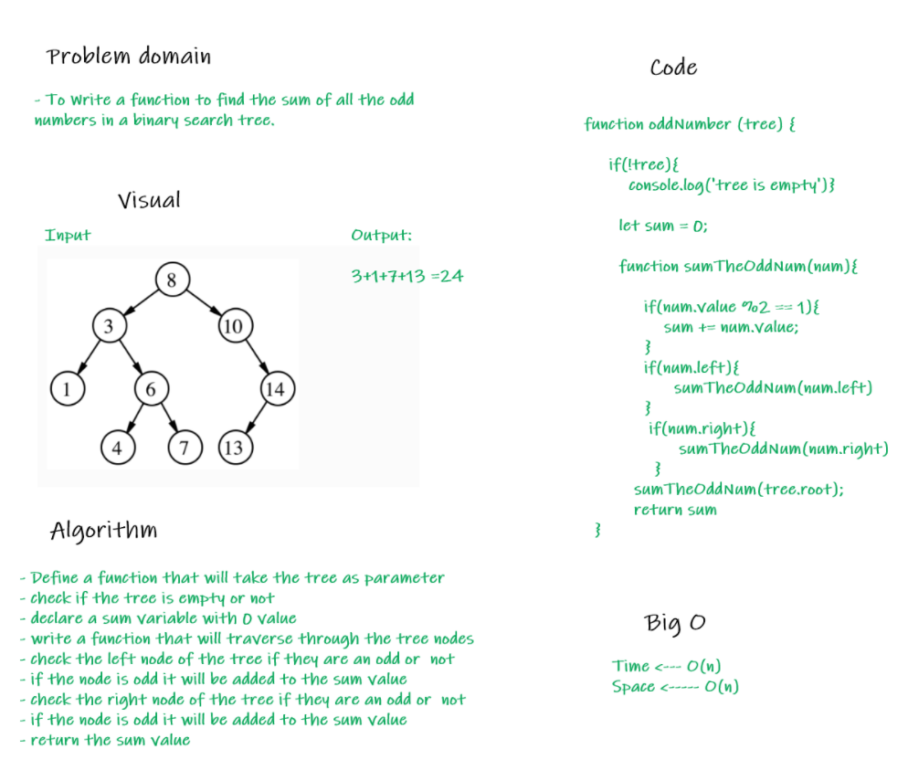

# Code challenge 19:

**Sum-Odd-Number-BT**
To Write a function to find the sum of all the odd numbers in a binary search tree.

## Whiteboard Process
<!-- Embedded whiteboard image -->

## Approach & Efficiency
<!-- What approach did you take? Why? What is the Big O space/time for this approach? -->
I used class and quality test to make sure that all of my methods will work
