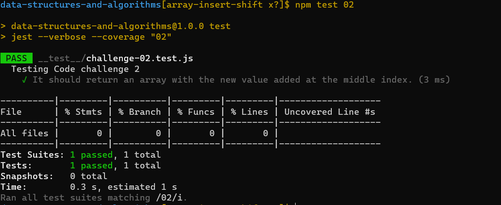

# data-structures-and-algorithms

# Reverse an Array

it's a new way to make our challenge and i like it because we know how the test work now and we do the test part 

## Whiteboard Process
<!-- Embedded whiteboard image -->

## Approach & Efficiency

<!-- What approach did you take? Discuss Why. What is the Big O space/time for this approach? -->
I used map and quality test to make sure every things goes well.

////////////////////////
# Insert to Middle of an Array
<!-- Description of the challenge -->
it's a new way to make our challenge and i like it because we know how the test work now and we do the test
## Whiteboard Process
<!-- Embedded whiteboard image -->

**proplem domain**
Write a function called insertShiftArray which takes in an array and a value to be added. Without utilizing any of the built-in methods available to your language, return an array with the new value added at the middle index.
**algorthim**
- I use for loop to iterative the array
- if statment to check the possibility
**visual**
input:([2, 4, 6, -8], 5)
output:([2, 4, 5, 6, -8])
## Approach & Efficiency
<!-- What approach did you take? Discuss Why. What is the Big O space/time for this approach? -->
I used for loop, replit and quality test to make sure every things goes well.