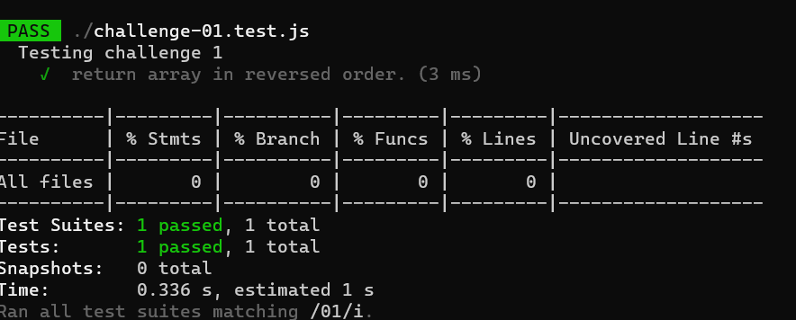

# data-structures-and-algorithms

# Reverse an Array

it's a new way to make our challenge and i like it because we know how the test work now and we do the test part 

## Whiteboard Process
<!-- Embedded whiteboard image -->

## Approach & Efficiency
<!-- What approach did you take? Discuss Why. What is the Big O space/time for this approach? -->
I used map and quality test to make sure every things goes well.

